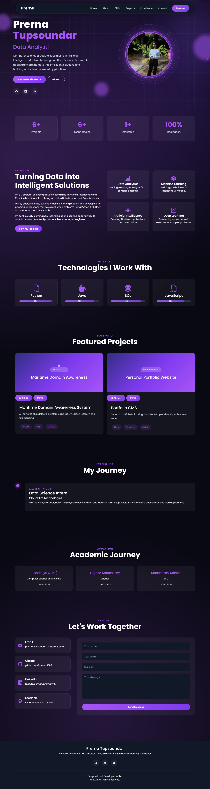

# 🌐 Personal Portfolio Website

A modern and responsive personal portfolio website built with **Flask**, **HTML**, **CSS**, **JavaScript**, and **Bootstrap**. This portfolio showcases my skills, projects, education, experience, and contact information with a clean UI and smooth animations.

## 🚀 Live Demo

🔗 https://personal-portfolio-o1ff.onrender.com/

## 📸 Preview


---

## ✨ Features

- Responsive modern UI
- Animated typing effect
- Glassmorphism design
- Interactive hero section
- Skills section with progress bars
- Featured projects section
- Experience timeline
- Education section
- Resume download
- Social media links
- Contact form
- Scroll animations (AOS)
- Scroll-to-top button

---

## 🛠️ Tech Stack

### Frontend
- HTML5
- CSS3
- Bootstrap 5
- JavaScript

### Backend
- Flask (Python)

### Deployment
- Render

---

## 📂 Project Structure

```
Portfolio/
│
├── app.py
├── requirements.txt
├── Procfile
├── runtime.txt
│
├── static/
│   ├── css/
│   ├── js/
│   └── images/
│
├── templates/
│   ├── index.html
│   └── components/
│
└── README.md
```

---

## ⚙️ Installation

Clone the repository

```bash
git clone https://github.com/prerna0003/personal-portfolio.git
```

Go to the project folder

```bash
cd personal-portfolio
```

Create a virtual environment

```bash
python -m venv venv
```

Activate it

Windows

```bash
venv\Scripts\activate
```

Install dependencies

```bash
pip install -r requirements.txt
```

Run the project

```bash
python app.py
```

Open

```
http://127.0.0.1:5000
```

---

## 📌 Future Improvements

- Admin Dashboard
- Portfolio CMS
- Project CRUD
- Skills CRUD
- Experience CRUD
- Education CRUD
- Contact Message Storage
- Dark / Light Mode
- Blog Section
- Visitor Analytics

---

## 👩‍💻 About Me

I am **Prerna Tupsoundar**, a recent Computer Science graduate passionate about **Data Science, Data Analytics, Machine Learning, Deep Learning, Artificial Intelligence, and Python Development**. I enjoy building intelligent, scalable, and user-friendly applications while continuously learning new technologies.

---

## 📬 Contact

📧 Email: prernatupsoundar074@gmail.com

💼 LinkedIn: https://linkedin.com/in/prerna7403

💻 GitHub: https://github.com/prerna0003

🌐 Portfolio: https://personal-portfolio-o1ff.onrender.com/

---

## ⭐ Support

If you like this project, consider giving it a ⭐ on GitHub.

---

© 2026 Prerna Tupsoundar. All Rights Reserved.
